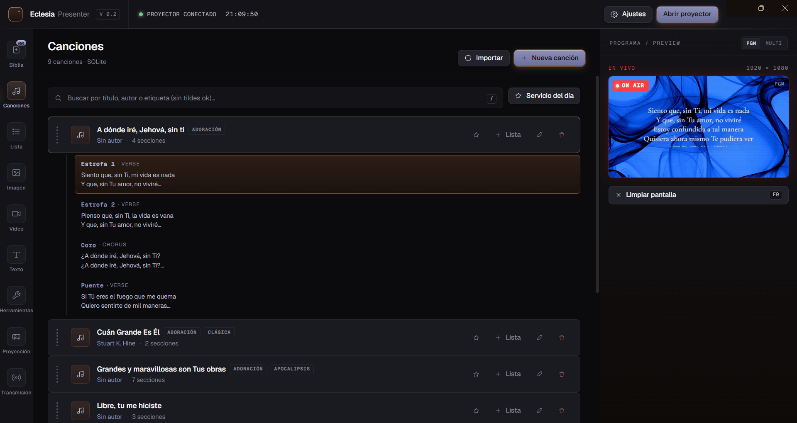
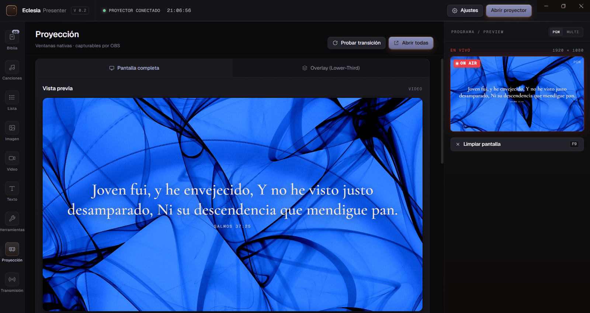
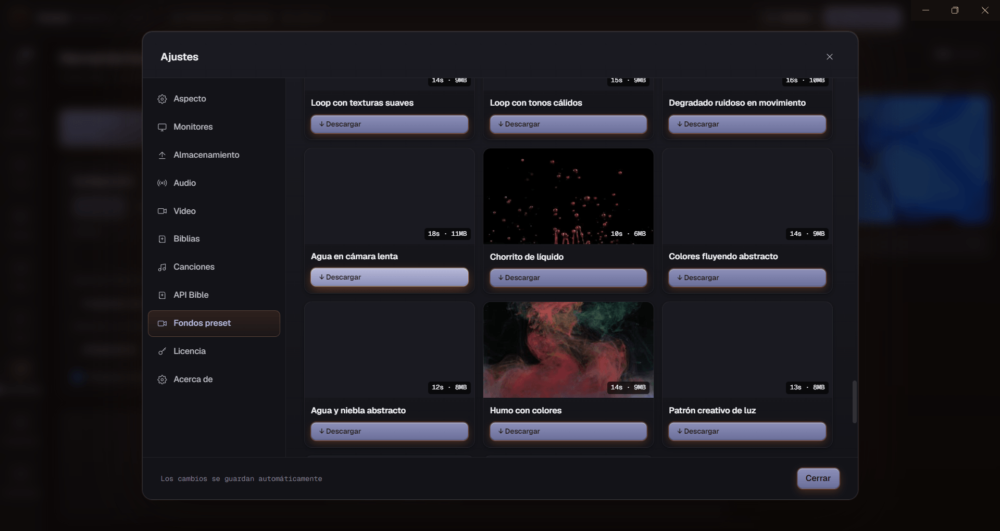
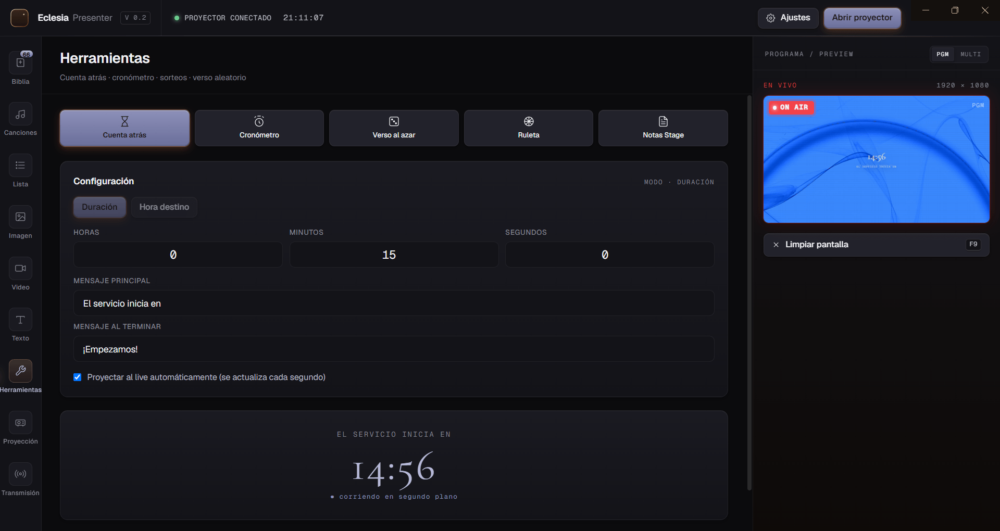

<div align="center">


# EclesiaPresenter

**Software libre de presentación para iglesias — alternativa OSS a ProPresenter / EasyWorship.**

[](https://github.com/Juanalejo01/eclesia-presenter/releases/latest)
[](https://github.com/Juanalejo01/eclesia-presenter/actions/workflows/release.yml)
[](LICENSE)
[](https://github.com/Juanalejo01/eclesia-presenter/releases)
[](https://github.com/Juanalejo01/eclesia-presenter/stargazers)

[🌐 **Web oficial**](https://eclesia-presenter.vercel.app) ·
[📥 **Descargar**](https://eclesia-presenter.vercel.app/download) ·
[📖 **Documentación**](https://eclesia-presenter.vercel.app/docs) ·
[🗺 **Roadmap**](ROADMAP.md)

</div>

---

<div align="center">
  
  <p><em>Hebreos 1:10 al aire desde el panel de Biblia. El monitor PGM de la derecha muestra exactamente lo que ve la congregación.</em></p>
</div>

---

## ¿Por qué EclesiaPresenter?

ProPresenter cuesta **$500+ al año**. EasyWorship **$395**. Para una iglesia
pequeña en LATAM o España, eso es prohibitivo. EclesiaPresenter es **gratis** y
**open-source (MIT)**, diseñado específicamente para iglesias de habla hispana.

|  | EclesiaPresenter | ProPresenter | EasyWorship |
|---|:---:|:---:|:---:|
| Precio | **Gratis** (Pro: 9€/mes) | $500/año | $395/año |
| Open source | ✅ MIT | ❌ | ❌ |
| Documentación en español | ✅ | ⚠️ Parcial | ⚠️ Parcial |
| Cloud sync entre PCs | ✅ Pro | ✅ | ⚠️ |
| Control móvil sin instalar app | ✅ (web + PIN) | ⚠️ App nativa | ⚠️ |
| Plan Lifetime | ✅ 249€ | ❌ Solo suscripción | ❌ |

📊 [Análisis competitivo completo →](docs/FEATURE_ANALYSIS.md)

---

## ✨ Características

### 📖 Biblia multi-versión
7 traducciones offline (RVR 1909, NVI, DHH, LBLA, NTV, PDT, TLA) +
soporte para versiones remotas vía [api.bible](https://api.bible).
Búsqueda por libro/capítulo/versículo, selección múltiple estilo Finder.

<!--  -->

### 🎵 Editor de canciones
Plantillas de estructura (verso/coro/puente), auto-split por longitud,
vista previa con tema aplicado. Persistencia en SQLite.

<p align="center">
  
</p>

### 📋 Lista del día con drag & drop
Reordena con el ratón, navega con `←/→` durante el servicio en vivo.

<!--  -->

### 🖥 Proyección broadcast-ready
Dos ventanas nativas:
- **Pantalla completa** para el proyector físico (1920×1080).
- **Overlay transparente** capturable por OBS sin compartir pantalla.

Configurable desde el panel **Proyección** con preview en vivo del tema
aplicado, control de detección de monitores y ajustes de transición.

<p align="center">
  
</p>

### 🎛 Monitor PGM/PVW (broadcast pro)
Vista lateral con tally `ON AIR`, modo Live/Preview, "Tomar al aire" estilo
mesa de TV. Útil para iglesias que streamean a YouTube/Facebook.

### 🎨 Tema personalizable + biblioteca de fondos CC0
Fondo (color sólido, gradiente, imagen, video, transparente), tipografía,
transiciones (fade, slide, zoom), posición vertical, sombras.

**+ Biblioteca incluida** de 56 videos worship CC0 curados de Pexels en 4
categorías (partículas, cielo, naturaleza, loops abstractos). Descarga
bajo demanda — no inflan el .exe.

<p align="center">
  
</p>

### 📺 Stage Display v2
Monitor para el predicador / vocalistas con:
- Slide actual + próximo pre-renderizado
- Reloj grande
- Notas privadas (solo visibles aquí, no en proyector)
- Countdown integrado si hay cuenta atrás activa

### ☁ Cloud sync (Pro)
Tus canciones aparecen en cualquier PC tras login. Sync 2-way con
conflict resolution (last-write-wins + tombstones para soft-delete).
Backend: Supabase + Row Level Security.

### 📱 Control remoto móvil
Servidor LAN embebido (socket.io). Cualquier móvil del WiFi accede vía
navegador con PIN — sin instalar nada. 3 pestañas: Slides / Biblia / Lista.

### 🔄 Auto-updater
Detecta nueva versión en startup, descarga en background, instala al
reiniciar. Funciona con NSIS installer. Portables reciben aviso para
descarga manual.

### 🧰 Panel de Herramientas
Widgets útiles durante el servicio que **no** existen en ProPresenter ni EasyWorship:

- **Countdown / cuenta atrás** proyectable ("El servicio empieza en 1:26:43")
- **Cronómetro** para dinámicas de tiempo limitado
- **Verso aleatorio** filtrable por testamento, libro o "mis favoritos"
- **Ruleta** con animación SVG para sorteos (lista editable + "no repetir ganador")

<p align="center">
  
</p>

### ⌨ Atajos globales
`Ctrl+1..4` cambia panel · `←/→` navega slides · `B` blanco · `.` blackout

---

## 🚀 Quick start

### Para usuarios

Descarga el instalador desde [eclesia-presenter.vercel.app/download](https://eclesia-presenter.vercel.app/download).
Disponible para Windows (NSIS + portable) y macOS (zip arm64).

### Para desarrolladores

```bash
git clone https://github.com/Juanalejo01/eclesia-presenter.git
cd eclesia-presenter
npm install
npm run dev
```

`npm run dev` levanta Vite en `localhost:5173` y Electron en paralelo.

### Para builders

```bash
npm run dist:all    # Windows: portable + NSIS setup + iconos embedded
npm run dist:mac    # macOS arm64 zip
npm run dist:linux  # Linux AppImage
```

---

## 🏗 Arquitectura

```
┌─────────────────────────────────────────────────────────────────┐
│                       DESKTOP (Electron)                          │
│                                                                   │
│  ┌──────────────┐  IPC  ┌──────────────┐                         │
│  │   Renderer   │ ←───→ │   Main       │                         │
│  │   (React)    │       │   Process    │                         │
│  └──────────────┘       └──────┬───────┘                         │
│         │                       │                                 │
│         │           ┌───────────┼──────────┬────────────┐         │
│         │           ↓           ↓          ↓            ↓         │
│         │     ┌──────────┐ ┌─────────┐ ┌────────┐ ┌─────────┐    │
│         │     │  SQLite  │ │socket.io│ │auto-   │ │ preset:// │    │
│         │     │ (better- │ │ server  │ │updater │ │ media://  │    │
│         │     │  sqlite3)│ │  (LAN)  │ │        │ │ protocols │    │
│         │     └──────────┘ └────┬────┘ └───┬────┘ └─────────┘    │
│         │                       │          │                      │
│         ↓                       ↓          ↓                      │
│  ┌──────────────┐         📱 móviles    GitHub                    │
│  │  Projection  │         del WiFi      Releases                  │
│  │   Windows    │                                                 │
│  │  (full-screen│                                                 │
│  │  + overlay)  │                                                 │
│  └──────────────┘                                                 │
└────────────────────────────────┬────────────────────────────────┘
                                 │ HTTPS
                                 ↓
            ┌────────────────────────────────────┐
            │         CLOUD (Vercel + Supabase)   │
            │                                     │
            │  ┌──────────┐    ┌───────────────┐ │
            │  │ Next.js  │ ─→ │ Supabase      │ │
            │  │ (landing,│    │ Postgres +    │ │
            │  │ pricing, │    │ RLS + Storage │ │
            │  │ /api)    │    └───────────────┘ │
            │  └────┬─────┘                       │
            │       │                             │
            │       ↓                             │
            │  ┌──────────┐                       │
            │  │  Stripe  │ (checkout, portal,    │
            │  │          │  licencias)           │
            │  └──────────┘                       │
            └─────────────────────────────────────┘
```

```
src/
├── main/                 # Electron main process
│   ├── main.js           # Entry: BrowserWindow, IPC handlers, protocols
│   ├── projection.js     # Ventanas de proyección (overlay + fullscreen)
│   ├── database.js       # SQLite schema + migrations + sync payload
│   ├── cloudSync.js      # 2-way merge con Supabase
│   ├── backgroundLibrary.js  # Catálogo CC0 + descargas con progreso
│   ├── autoUpdater.js    # electron-updater + GitHub Releases
│   ├── license.js        # Validación Stripe license keys
│   └── preload.js        # contextBridge API expuesta al renderer
├── renderer/             # React app (Vite)
│   ├── components/       # BiblePanel, SongsPanel, ToolsPanel, Settings…
│   ├── services/         # apiBible, themeStore, slideStore, cloudSync…
│   ├── pages/            # StageDisplay (ventana standalone)
│   └── styles/           # eclesia-design.css (tokens + componentes)
└── server/               # Express + socket.io para mobile remote

web/                      # Next.js 14 (Vercel) — landing + pricing + API
├── app/                  # App Router: page, pricing, download, docs, cuenta
├── components/           # Hero, Pricing, Navbar, Footer, MobileMenu
└── supabase/             # SQL migrations + setup guides
```

---

## 🛠 Stack técnico

<p>
  
  
  
  
  
  
  
  
  
  
  
  
</p>

| Capa | Tecnologías clave |
|---|---|
| Desktop UI | Electron 29, React 18, Vite 5, Tailwind 3 |
| Local DB | SQLite vía `better-sqlite3` con migraciones por código |
| Cloud DB | Supabase Postgres + Row Level Security |
| Sync | 2-way merge con last-write-wins + tombstones (soft-delete) |
| Pagos | Stripe Checkout + Customer Portal + Webhooks |
| Web | Next.js 14 (App Router) en Vercel, ISR para `/docs` |
| Real-time | socket.io para mobile remote control LAN |
| Distribución | electron-builder + electron-updater + GitHub Releases |
| Code signing | SignPath Foundation (OSS) → futuro Azure Trusted Signing |
| CI/CD | GitHub Actions: matrix Windows + macOS, build → sign → release |
| Observabilidad | Sentry (opcional) en main process |

---

## 📅 Roadmap

Resumen — ver [ROADMAP.md](ROADMAP.md) para el plan completo.

- ✅ **v0.2.x** — Cloud sync, biblioteca de fondos preset, auto-updater,
  stage display v2, custom title bar Win11.
- 🚧 **v0.3.x** (Q2 2026) — Code signing oficial, soporte macOS estable,
  Linux, más transiciones.
- 🔭 **v0.4.x** (Q3 2026) — Editor visual de temas, anuncios e imágenes,
  multi-pantalla nativa.
- 🎯 **v1.0** (Q4 2026) — Sin avisos de SmartScreen, tests > 60%,
  100+ instalaciones activas.

---

## 📚 Documentación

| Archivo | Contenido |
|---|---|
| [ROADMAP.md](ROADMAP.md) | Plan público hasta v1.0 |
| [docs/CODE_SIGNING.md](docs/CODE_SIGNING.md) | Estrategia SignPath + Azure Trusted Signing |
| [docs/SIGNPATH_APPLICATION.md](docs/SIGNPATH_APPLICATION.md) | Formulario pre-rellenado para SignPath OSS |
| [docs/FEATURE_ANALYSIS.md](docs/FEATURE_ANALYSIS.md) | Análisis competitivo vs ProPresenter / EasyWorship |
| [docs/screenshots/README.md](docs/screenshots/README.md) | Guía para capturas y GIFs del README |

Web oficial con docs detalladas: [eclesia-presenter.vercel.app/docs](https://eclesia-presenter.vercel.app/docs).

---

## 🤝 Contribuir

¿Encontraste un bug o quieres pedir una feature?

- **Issues**: usa los templates en [Issues](https://github.com/Juanalejo01/eclesia-presenter/issues).
- **Pull Requests**: abre un Issue primero para discutir el alcance.
- **Votar features**: reacciona con 👍 a los Issues del [roadmap](ROADMAP.md).

Si usas EclesiaPresenter en tu iglesia, **comparte tu historia** —
contacta vía la web para que aparezca en [/casos-de-uso](https://eclesia-presenter.vercel.app/casos-de-uso).

---

## 📜 Licencia

[MIT](LICENSE) — uso libre comercial y personal, con atribución.

Las traducciones bíblicas incluidas mantienen sus respectivas licencias:
- **RVR 1909** — Dominio público
- **NVI, DHH, LBLA, NTV, PDT, TLA** — Uso devocional, ver licencias originales
  de Sociedades Bíblicas Unidas, Bíblica Inc., The Lockman Foundation, Tyndale
  House y Centro Mundial de Traducción de la Biblia.

---

## 🙏 Agradecimientos

- [SignPath Foundation](https://signpath.org/) — code signing gratuito para OSS
- [Pexels](https://www.pexels.com/) — videos CC0 del catálogo de fondos
- [Supabase](https://supabase.com/) — backend Postgres + RLS
- La comunidad de iglesias hispanas que motivó este proyecto

---

<div align="center">

**Hecho con ❤ por [Juan Alejandro López Ospina](https://github.com/Juanalejo01) para la iglesia.**

⭐ Si este proyecto te resulta útil, una estrella en GitHub ayuda muchísimo a darlo a conocer.

</div>
